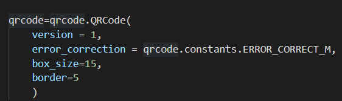

# python QR Code generator
This project will be used to generate QR codes which is a type of matrix barcode first designed in 1994 for the automotive industry in Japan. 
A barcode is a machine-readable optical label that contains information about the item to which it is attached.

# Packages required and its installation:
We will be requiring the qrcode package to implelement this project
For a standard install (which will include pillow for generating images), run:
-> pip install qrcode[pil]

# How will this project work?
In this project we will be using the QRCode class. 

# Meanings of the parameters in the qrcode class are as follows:
(a) Version parameter will take an integer from 1 to 40 to control the size of the QR code. The smaller the number, the smaller the QR code size is going to 
(b) The error_correction parameter controls the error correction used for the QR Code. The following four constants are made available on the qrcode package:
* ERROR_CORRECT_L -> About 7% or less errors can be corrected.
* ERROR_CORRECT_M (default) -> About 15% or less errors can be corrected.
* ERROR_CORRECT_Q -> About 25% or less errors can be corrected.
* ERROR_CORRECT_H -> About 30% or less errors can be corrected.
(c) The box_size parameter controls the pixels for each "box" of the QR code
(d) The border parameter controls the border for the QR code

Following are the QR codes generated for the "www.google.com" and "www.udemy.com" through this project
*www.google.com

*www.udemy.com

 
